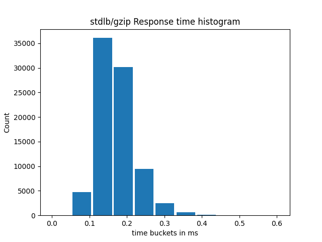

# gozlib

gozlib is a GC-friendly compression package with a low memory allocation footprint. It provides various interfaces into the zlib library, using cgo for interoperability. See https://github.com/madler/zlib for details about zlib.

## Requirements

Using this package requires cgo and a gnu compiler (clang or gcc), as well as the development version of zlib installed.
By default, it expect the zlib header and so files to be in the standard include and library path.
If not, you can override it by setting the appropriate paths in the environment variables CGO_CFLAGS and CGO_LDFLAGS.

## Implementation and usage

Internally gozlib utilizes [dxpool as an off-heap memory pool](https://github.com/bignacio/dxpool#the-dynamic-memory-pool) to maximize memory usage. At this moment, allocated memory is never returned to the system so gozlib is best used when gzip operations are frequent and constant.

This pool is also available for use in the Go code as a way to allocate and reuse byte slices.
See `NativeSlicePool` for details.

### Compression and uncompression components

gozlib supports 3 different mechanisms for compressing and uncompressing data, each ideal to different use cases.

1. Single step, in memory using `GoGZipCompressBuffer`/`GoUncompressBuffer`
2. Event based with `GoGZipCompressStream`/`GoUncompressStream`
3. Stream based, implementing `io.Reader`/`io.Writer` created through `NewGoZLibCompressor` and `NewGoZLibUncompressor`. The returned object can be used as a drop in replacement to the standard library gzip implementation (or anything compatible with the `io` interfaces).

Single step and event based possible through stateless functions while the stream based option keeps states through the returned object.

Like the standard library gzip implementation, it's possible to flush and reset gozlib's compressor and uncompressor so that they can be pooled and reused.

See the [documentation](gozlib.go) and test files for usage examples and details.

Remember that the stream based, stateful use of gozlib require `Close()` to be invoked to avoid memory leaks.

## Performance

While gozlib is designed to be GC friendly in that it keeps heap allocations to a minimum, managed and unmanaged.

For memory intensive applications, like web services that have to support http compression, an overall performance gain can be obtained just by reducing the frequency and duration of GC runs and pauses.

It's important to note that there is a penalty calling cgo and while the underlying zlib implementation can be faster, benchmarking and carefully measuring performance is necessary to decided on the best approach for each use case.

General case benchmarks show that gozlib performs better in terms of speed and memory utilization. See results below.

### HTTP request compression benchmark results
```
gozlib
  Requests/sec:	259.1624

stdlib gzip
  Requests/sec:	139.3972
```

Response time distribution




GC Pause time, as described [in the runtime documentation](https://pkg.go.dev/runtime#MemStats)
> PauseTotalNs is the cumulative nanoseconds in GC
	stop-the-world pauses since the program started.
	During a stop-the-world pause, all goroutines are paused
	and only the garbage collector can run.


Cumulative number of GC runs
